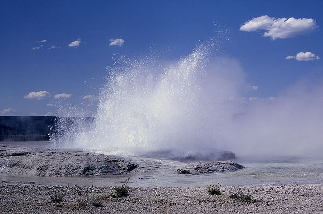

## Predicting the Waiting Time after a Geyser Eruption

<style>
h1, h2, h3, h4, h5 {
    text-align: center; 
    margin-bottom: 20px;
}
article p {
    font-size: 24px;
    color: #231f20;
    line-height: 1.5;
}
</style>

<h5 style="margin-top: 0px; margin-bottom: 0px;">Kristiaan De Jongh, 11.06.2021</h5>

<div style="text-align: center; margin-top: 40px;"></div>

--- .class #id 

## The Geyser Eruption App

The <strong>Geyser Eruption App</strong> predicts the waiting time after a geyser 
eruption until the next eruption.

The data set used is the <i>'Old Faithful Geyser Data'</i>, the 'Old Faithful' 
being a cone geyser located in the Yellowstone National Park, Wyoming, USA.

The data set contains 272 observations of 2
variables, i.e. the eruption time and the waiting time until the next eruption.


```r
summary(faithful$eruptions)
```

```
   Min. 1st Qu.  Median    Mean 3rd Qu.    Max. 
  1.600   2.163   4.000   3.488   4.454   5.100 
```

```r
summary(faithful$waiting)
```

```
   Min. 1st Qu.  Median    Mean 3rd Qu.    Max. 
   43.0    58.0    76.0    70.9    82.0    96.0 
```

--- .class #id 

## Old Faithful Geyser Data

A scatter plot of the data shows a linear relationship between the 
eruption time and the waiting time until the next eruption.

The histogram shows the distribution of the observations with an average eruption time
3.5 seconds.


--- .class #id 

## Prediction Model

To predict the waiting time after an eruption a linear model is built, putting the 
waiting time in respect to the eruption time. The coefficients have very small p-values,
proving the correlation:


```r
fit <- lm(waiting ~ eruptions, data = faithful)
summary(fit)$coeff
```

```
            Estimate Std. Error  t value      Pr(>|t|)
(Intercept) 33.47440  1.1548735 28.98534  7.136015e-85
eruptions   10.72964  0.3147534 34.08904 8.129959e-100
```

Example: A prediction for the waiting time after an eruption time of 2.5 seconds:


```r
predict(fit, newdata = data.frame(eruptions = c(2.5)))
```

```
      1 
60.2985 
```

--- .class #id 

## Geyser Eruption App

<small>
Link to the App on shinyapps.io [https://kdejongh.shinyapps.io/geyser_app/](https://kdejongh.shinyapps.io/geyser_app/)
</small>

<iframe src="https://kdejongh.shinyapps.io/geyser_app/" style="height: 550px; margin-top: 0;"></iframe>
